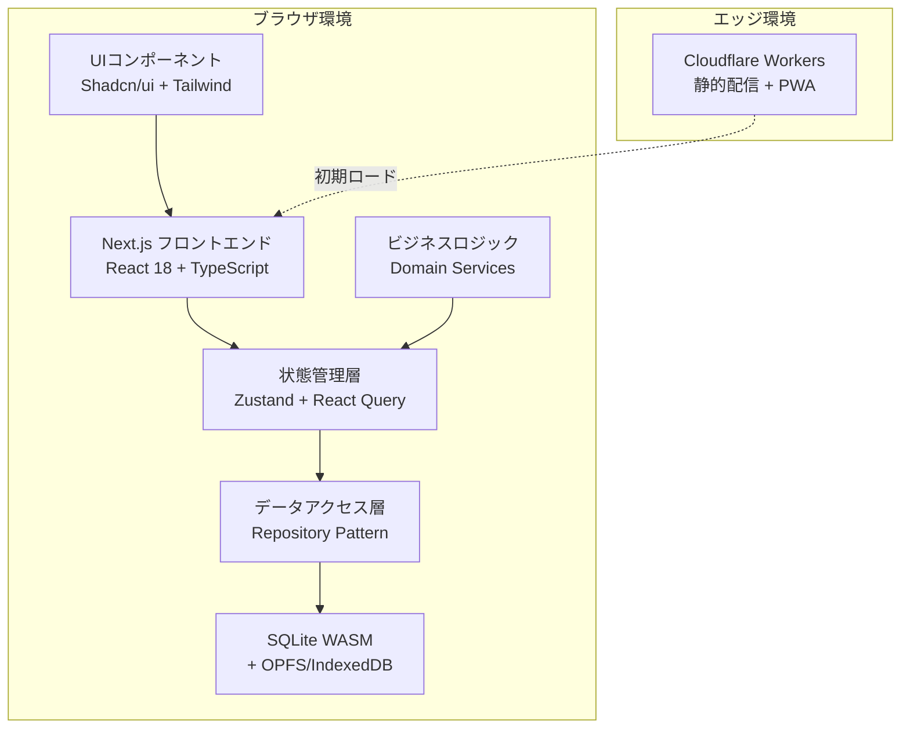
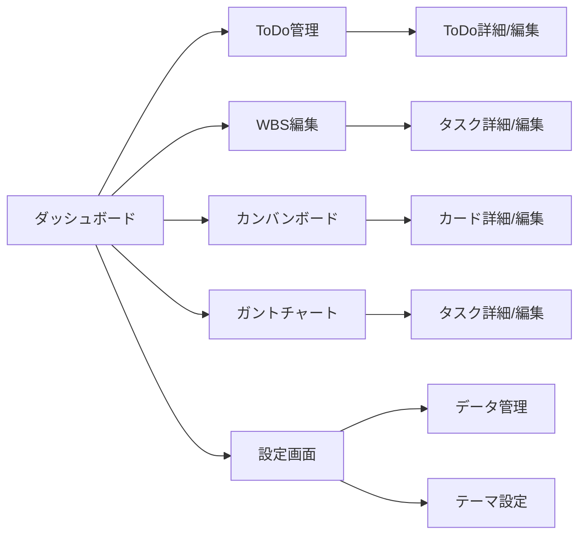
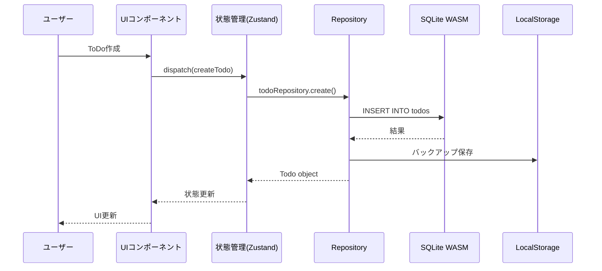
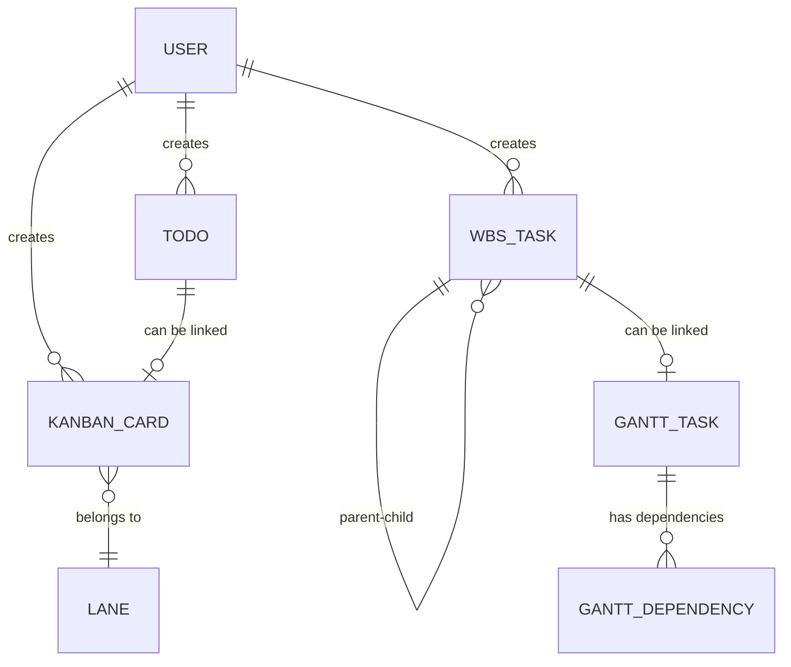

# 技術設計書

## 概要
本設計書は、非プログラマー向け生産性ツール集の技術アーキテクチャと実装方針を定義します。ローカルファーストアプローチを採用し、SQLite WASMを中心としたオフライン対応のWebアプリケーションを構築します。Next.js 14のApp Routerとサーバーコンポーネントを活用し、初期ロードの高速化とSEO最適化を実現しながら、すべてのデータ操作をクライアントサイドで完結させます。

## 要件マッピング

### 設計コンポーネントのトレーサビリティ
各設計コンポーネントが対応する要件：
- **SQLite WASMデータレイヤー** → 要件5.1-5.7: データ永続化とセキュリティ
- **Todoモジュール** → 要件1.1-1.7: ToDo管理機能
- **WBSモジュール** → 要件2.1-2.7: WBS機能
- **カンバンモジュール** → 要件3.1-3.7: カンバンボード機能
- **ガントチャートモジュール** → 要件4.1-4.7: ガントチャート機能
- **UIコンポーネントライブラリ** → 要件6.1-6.7: ユーザーインターフェース

### ユーザーストーリーカバレッジ
- 一般職の利用者向けToDo管理: 直感的なUIとオフライン対応により実現
- プロジェクトマネージャー向けWBS/ガント: 階層構造とタイムライン可視化で対応
- チームメンバー向けカンバン: ドラッグ&ドロップによる状態管理で実装
- 個人ユーザー向けデータ保護: ローカル完結型アーキテクチャで保証

## アーキテクチャ



### 技術スタック

- **フロントエンド**: Next.js 14 (App Router) + TypeScript 5.x
- **状態管理**: Zustand (グローバル状態) + React Query (非同期状態)
- **データベース**: SQLite WASM 3.45+ (OPFS/IndexedDB)
- **UIフレームワーク**: Shadcn/ui + Radix UI + Tailwind CSS 3.4
- **ビルド/配信**: Cloudflare Workers + Wrangler
- **テスト**: Vitest + Testing Library + Playwright
- **開発環境**: Bun (高速ビルド) + ESLint + Prettier

### アーキテクチャ決定根拠

- **なぜSQLite WASM**: 完全オフライン対応、複雑なクエリ対応、トランザクション保証、5MB制限の回避
- **なぜNext.js 14**: 静的生成による高速初期表示、React Server Components、優れた開発体験
- **なぜZustand**: 軽量（8KB）、TypeScript親和性、React Suspense対応、シンプルなAPI
- **なぜShadcn/ui**: 高いアクセシビリティ、カスタマイズ性、コンポーネントの所有権、軽量

### 画面遷移



### データフロー

#### 主要ユーザーフロー



## コンポーネントとインターフェース

### バックエンドサービス＆メソッドシグネチャ

```typescript
// Repository層
class TodoRepository {
  async create(data: CreateTodoDto): Promise<Todo>      // ToDoを作成し永続化
  async update(id: string, data: UpdateTodoDto): Promise<Todo>  // ToDo更新
  async delete(id: string): Promise<void>               // ToDo削除
  async findAll(filter?: TodoFilter): Promise<Todo[]>   // ToDo一覧取得
  async findById(id: string): Promise<Todo | null>      // ToDo詳細取得
}

class WBSRepository {
  async createTask(data: CreateWBSTaskDto): Promise<WBSTask>    // タスク作成
  async updateHierarchy(taskId: string, parentId: string | null): Promise<void>  // 階層更新
  async calculateProgress(taskId: string): Promise<number>       // 進捗計算
  async updateHierarchyNumbers(projectId: string): Promise<void> // 階層番号の再採番
  async calculateWorkDays(startDate: Date, endDate: Date): Promise<number> // 工数計算
  async insertTaskAfter(taskId: string, afterTaskId: string): Promise<WBSTask> // タスク挿入
}

class KanbanRepository {
  async moveCard(cardId: string, laneId: string, position: number): Promise<void>  // カード移動
  async checkWIPLimit(laneId: string): Promise<boolean>         // WIP制限確認
  async createLane(data: CreateLaneDto): Promise<Lane>          // レーン作成
}

class GanttRepository {
  async updateSchedule(taskId: string, start: Date, end: Date): Promise<void>     // スケジュール更新
  async createDependency(fromId: string, toId: string): Promise<void>            // 依存関係作成
  async calculateCriticalPath(projectId: string): Promise<string[]>              // クリティカルパス計算
  async setTaskIcon(taskId: string, icon: string): Promise<void>                 // タスクアイコン設定
  async setTaskColor(taskId: string, color: string): Promise<void>               // タスク色設定
  async assignMember(taskId: string, memberId: string): Promise<void>            // メンバー割り当て
  async createTaskGroup(name: string, color: string): Promise<string>            // タスクグループ作成
  async moveTaskToGroup(taskId: string, groupId: string): Promise<void>          // グループへタスク移動
  async updateHierarchy(taskId: string, parentId: string | null): Promise<void>  // 階層構造更新
}
```

### フロントエンドコンポーネント

| コンポーネント名 | 責任 | Props/State概要 |
|--------------|------|----------------|
| TodoList | ToDo一覧表示・フィルタリング | todos[], filter, onTodoClick |
| TodoForm | ToDo作成・編集フォーム | todo?, onSubmit, onCancel |
| WBSTree | WBS階層構造表示 | tasks[], onTaskDrop, onTaskClick |
| WBSTreeEnhanced | WBS拡張階層表示 | tasks[], onTaskClick, showTaskNumbers, colorByStatus, showColumnSettings |
| WBSTaskFormEnhanced | WBS拡張タスクフォーム | task?, parentTask?, onSubmit, onCancel, enableDateCalculation |
| WBSTaskFormPro | WBSプロフェッショナルフォーム | task?, parentTask?, onSubmit, onCancel, isInsertMode |
| WBSTablePro | WBSプロフェッショナルテーブル | tasks[], onTaskClick, onInsertTask, onUpdateTask, onDeleteTask |
| WBSTaskReorder | タスク順序変更機能 | task, onReorder, constraints |
| WBSTaskDelete | タスク削除機能 | task, onDelete, deleteChildren |
| WBSInsertTaskButton | タスク挿入ボタン | position, onInsert |
| WBSColumnResizer | 列幅調整機能 | columns[], onResize |
| KanbanBoard | カンバンボード表示 | lanes[], cards[], onCardMove |
| GanttChart | ガントチャート表示 | tasks[], dependencies[], zoom, viewMode |
| GanttToolbar | ガントツールバー | viewMode, onViewChange, onMemberManage |
| GanttTaskIcon | タスクアイコン表示 | type, size |
| GanttColorPicker | 色選択 | colors[], onColorSelect |
| GanttMemberSelector | メンバー選択 | members[], onMemberSelect |
| GanttGroupManager | グループ管理 | groups[], onGroupCreate, onGroupEdit |
| GanttViewSelector | ビュー切り替え | currentView, onViewChange |
| GanttCalendarHeader | カレンダーヘッダー | year, month, days[], zoom |
| DataManager | データインポート/エクスポート | onExport, onImport, onClear |
| ThemeToggle | テーマ切り替え | theme, onThemeChange |

### APIエンドポイント

本アプリケーションはローカルファーストのため、従来のREST APIは存在しません。代わりに、クライアントサイドのRepositoryインターフェースを提供：

| メソッド | インターフェース | 目的 | 認証 | エラーハンドリング |
|---------|---------------|------|------|------------------|
| create | Repository.create(data) | リソース作成 | 不要 | try-catch |
| read | Repository.findAll/findById | リソース取得 | 不要 | try-catch |
| update | Repository.update(id, data) | リソース更新 | 不要 | try-catch |
| delete | Repository.delete(id) | リソース削除 | 不要 | try-catch |

## データモデル

### ドメインエンティティ
1. **Todo**: 基本的なタスク情報（タイトル、説明、期限、優先度、完了状態）
2. **WBSTask**: 階層的タスク（親子関係、見積時間、進捗率、担当者、レビュー者、期限）
3. **KanbanCard**: カンバンカード（タイトル、説明、レーン、ラベル、期限）
4. **Lane**: カンバンレーン（名前、順序、WIP制限、カード）
5. **GanttTask**: ガントタスク（開始日、終了日、依存関係、クリティカルパス）
6. **User**: ユーザー設定（テーマ、言語、表示設定）

### エンティティ関係



### データモデル定義

```typescript
// TypeScript インターフェース
interface Todo {
  id: string;
  title: string;
  description?: string;
  dueDate?: Date;
  priority: 'low' | 'medium' | 'high';
  completed: boolean;
  completedAt?: Date;
  createdAt: Date;
  updatedAt: Date;
}

interface WBSTask {
  id: string;
  title: string;
  parentId?: string;
  children: string[];
  hierarchyNumber?: string; // 階層番号（例: "1.1.1"）
  estimatedHours?: number;
  actualHours?: number;
  progress: number; // 0-100
  assignee?: string;
  reviewer?: string;
  startDate?: Date; // 開始日
  endDate?: Date; // 終了日
  dueDate?: Date;
  workDays?: number; // 工数（人日）
  remarks?: string; // 備考
  dependencies?: string[];
  createdAt: Date;
  updatedAt: Date;
}

interface KanbanCard {
  id: string;
  title: string;
  description?: string;
  laneId: string;
  position: number;
  labels: string[];
  dueDate?: Date;
  todoId?: string; // リンクされたToDo
  createdAt: Date;
  updatedAt: Date;
}

interface GanttTask {
  id: string;
  title: string;
  startDate: Date;
  endDate: Date;
  progress: number;
  dependencies: string[];
  isCriticalPath: boolean;
  icon?: 'folder' | 'document' | 'person' | 'task'; // タスクアイコン
  color?: string; // タスクバーの色（赤、青、緑、黄、紫など）
  category?: string; // カテゴリ（色分けの基準）
  parentId?: string; // 親タスク（階層構造）
  children?: string[]; // 子タスク
  assignee?: string; // 担当者
  assigneeIcon?: string; // 担当者アイコン
  groupId?: string; // グループID（背景色での区分け）
  wbsTaskId?: string; // リンクされたWBSタスク
  createdAt: Date;
  updatedAt: Date;
}
```

### データベーススキーマ

```sql
-- ToDo管理
CREATE TABLE todos (
  id TEXT PRIMARY KEY,
  title TEXT NOT NULL,
  description TEXT,
  due_date INTEGER,
  priority TEXT CHECK(priority IN ('low', 'medium', 'high')),
  completed INTEGER DEFAULT 0,
  completed_at INTEGER,
  created_at INTEGER NOT NULL,
  updated_at INTEGER NOT NULL
);

-- WBS管理
CREATE TABLE wbs_tasks (
  id TEXT PRIMARY KEY,
  title TEXT NOT NULL,
  parent_id TEXT,
  position INTEGER NOT NULL DEFAULT 0,
  hierarchy_number TEXT, -- 階層番号（例: "1.1.1"）
  estimated_hours REAL,
  actual_hours REAL,
  progress INTEGER DEFAULT 0,
  assignee TEXT,
  reviewer TEXT,
  start_date INTEGER, -- 開始日
  end_date INTEGER, -- 終了日  
  due_date TEXT,
  work_days REAL, -- 工数（人日）
  remarks TEXT, -- 備考
  created_at INTEGER NOT NULL,
  updated_at INTEGER NOT NULL,
  FOREIGN KEY (parent_id) REFERENCES wbs_tasks(id) ON DELETE CASCADE
);

-- カンバンボード
CREATE TABLE kanban_lanes (
  id TEXT PRIMARY KEY,
  title TEXT NOT NULL,
  position INTEGER NOT NULL,
  wip_limit INTEGER,
  created_at INTEGER NOT NULL
);

CREATE TABLE kanban_cards (
  id TEXT PRIMARY KEY,
  title TEXT NOT NULL,
  description TEXT,
  lane_id TEXT NOT NULL,
  position INTEGER NOT NULL,
  due_date INTEGER,
  todo_id TEXT,
  created_at INTEGER NOT NULL,
  updated_at INTEGER NOT NULL,
  FOREIGN KEY (lane_id) REFERENCES kanban_lanes(id) ON DELETE CASCADE,
  FOREIGN KEY (todo_id) REFERENCES todos(id) ON DELETE SET NULL
);

-- ラベル（多対多）
CREATE TABLE card_labels (
  card_id TEXT NOT NULL,
  label TEXT NOT NULL,
  color TEXT NOT NULL,
  PRIMARY KEY (card_id, label),
  FOREIGN KEY (card_id) REFERENCES kanban_cards(id) ON DELETE CASCADE
);

-- ガントチャート
CREATE TABLE gantt_tasks (
  id TEXT PRIMARY KEY,
  title TEXT NOT NULL,
  start_date INTEGER NOT NULL,
  end_date INTEGER NOT NULL,
  progress INTEGER DEFAULT 0,
  is_critical_path INTEGER DEFAULT 0,
  icon TEXT CHECK(icon IN ('folder', 'document', 'person', 'task')),
  color TEXT, -- タスクバーの色
  category TEXT, -- カテゴリ
  parent_id TEXT, -- 親タスク
  assignee TEXT, -- 担当者
  assignee_icon TEXT, -- 担当者アイコン  
  group_id TEXT, -- グループID
  wbs_task_id TEXT,
  created_at INTEGER NOT NULL,
  updated_at INTEGER NOT NULL,
  FOREIGN KEY (wbs_task_id) REFERENCES wbs_tasks(id) ON DELETE SET NULL,
  FOREIGN KEY (parent_id) REFERENCES gantt_tasks(id) ON DELETE CASCADE
);

CREATE TABLE gantt_dependencies (
  id TEXT PRIMARY KEY,
  predecessor_id TEXT NOT NULL,
  successor_id TEXT NOT NULL,
  FOREIGN KEY (predecessor_id) REFERENCES gantt_tasks(id) ON DELETE CASCADE,
  FOREIGN KEY (successor_id) REFERENCES gantt_tasks(id) ON DELETE CASCADE
);

-- インデックス
CREATE INDEX idx_todos_due_date ON todos(due_date);
CREATE INDEX idx_todos_completed ON todos(completed);
CREATE INDEX idx_wbs_parent ON wbs_tasks(parent_id);
CREATE INDEX idx_cards_lane ON kanban_cards(lane_id);
CREATE INDEX idx_gantt_dates ON gantt_tasks(start_date, end_date);
```

### マイグレーション戦略
- 初回起動時に自動的にスキーマを作成
- バージョン管理テーブルでスキーマバージョンを追跡
- 新バージョンでは自動マイグレーションを実行
- データ変換は可逆的に設計し、ロールバック可能に

## エラーハンドリング

### エラー分類と対処
1. **データベースエラー**: 自動リトライ後、ローカルストレージへフォールバック
2. **容量超過エラー**: 古いデータの自動アーカイブ提案
3. **データ整合性エラー**: トランザクションロールバック、ユーザーへ通知
4. **ブラウザ互換性エラー**: 機能制限モードへ自動切り替え

### ユーザー向けエラーメッセージ
- 技術的詳細を排除した平易な言葉
- 具体的な解決方法の提示
- エラーコードによるサポート対応

## セキュリティ考慮事項

### データ保護
- Web Crypto APIによるクライアントサイド暗号化（オプション）
- パスワード保護されたエクスポート機能
- XSS対策: React自動エスケープ + Content Security Policy

### プライバシー保護
- 完全ローカル動作、外部通信なし
- アナリティクスはオプトイン方式
- データは明示的な操作以外で共有されない

## パフォーマンス＆スケーラビリティ

### パフォーマンス目標
| メトリクス | 目標値 | 測定対象 |
|-----------|--------|----------|
| 初期表示時間 (FCP) | < 1.5秒 | 初回訪問時 |
| インタラクティブ時間 (TTI) | < 3秒 | 初回訪問時 |
| データ操作レスポンス | < 100ms | CRUD操作 |
| SQLiteクエリ (p99) | < 50ms | 複雑なクエリ |
| メモリ使用量 | < 150MB | 1000件データ |

### キャッシング戦略
- **ブラウザキャッシュ**: 静的アセット、Service Worker
- **メモリキャッシュ**: Zustand内の頻繁アクセスデータ
- **SQLiteキャッシュ**: プリペアドステートメント
- **計算結果キャッシュ**: React.memo、useMemo活用

### スケーラビリティアプローチ
- 仮想スクロールによる大量データ表示
- Web Workersでの重い計算処理
- インクリメンタルな進捗計算
- 遅延ローディングとコード分割

## テスト戦略

### リスクマトリクス
| 領域 | リスク | 必須 | オプション | 参照 |
|-----|--------|------|-----------|------|
| データ永続性 | H | Unit, Integration | E2E | 5.1-5.7 |
| UI操作 | M | Unit, E2E | Visual | 6.1-6.7 |
| データ整合性 | H | Unit, Property | Integration | 全般 |
| パフォーマンス | M | Unit | Load | 性能表 |
| ブラウザ互換 | M | Unit | Cross-browser | 6.4 |

### 最小限のテスト層
- Unit: Repository層、ビジネスロジック、Utilityのテスト
- Integration: SQLite WASMとの統合テスト
- E2E (≤3): ToDo作成、カンバン操作、データエクスポート/インポート

### CIゲート
| ステージ | 実行内容 | ゲート | SLA |
|---------|---------|--------|-----|
| PR | Unit + Lint | 失敗=ブロック | ≤3分 |
| main | Integration + E2E | 失敗=ブロック | ≤10分 |
| リリース前 | 全テスト + ビルド | 失敗=停止 | ≤15分 |

### 終了条件
- 重大バグ = 0
- 全CIゲート通過
- Lighthouseスコア: Performance > 90