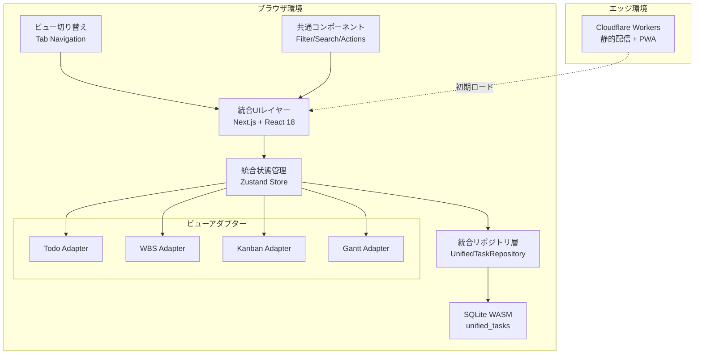
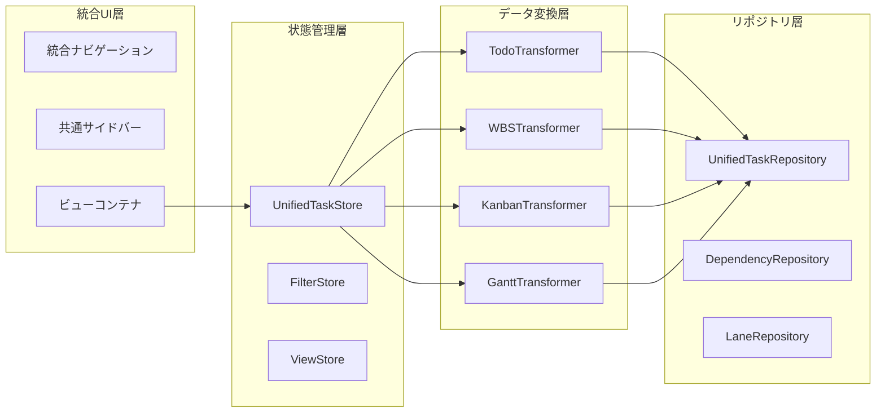
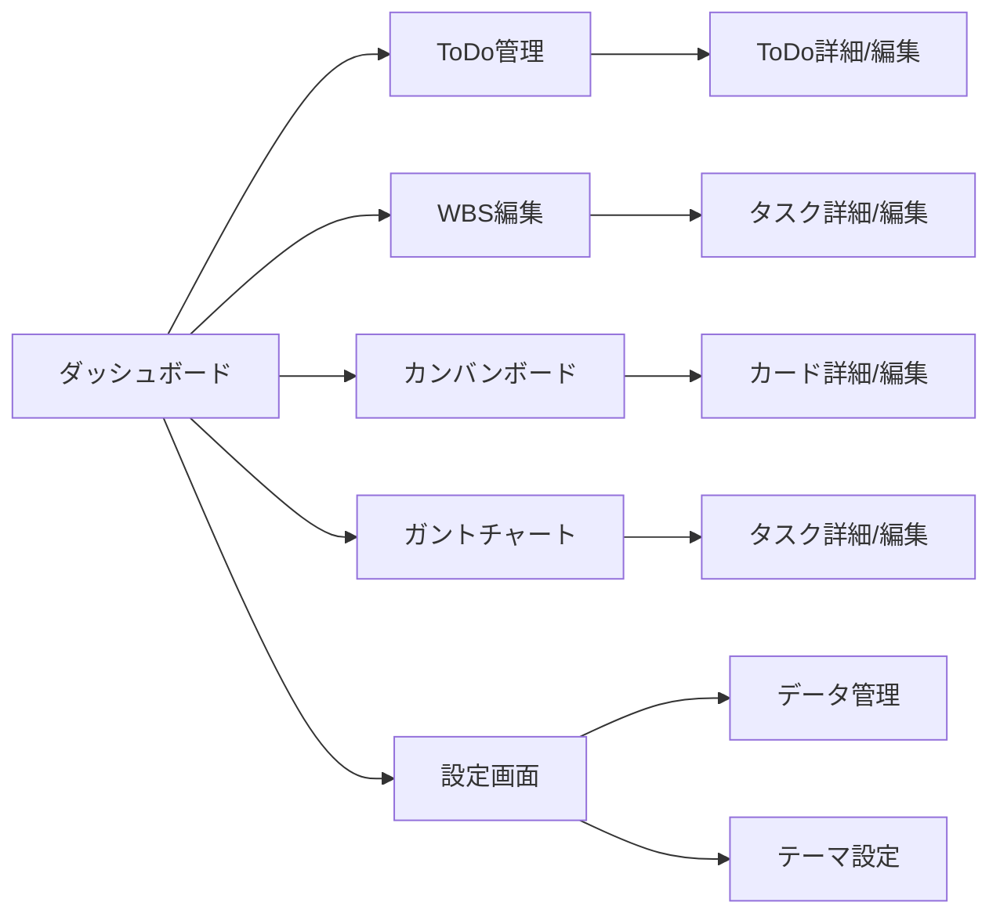
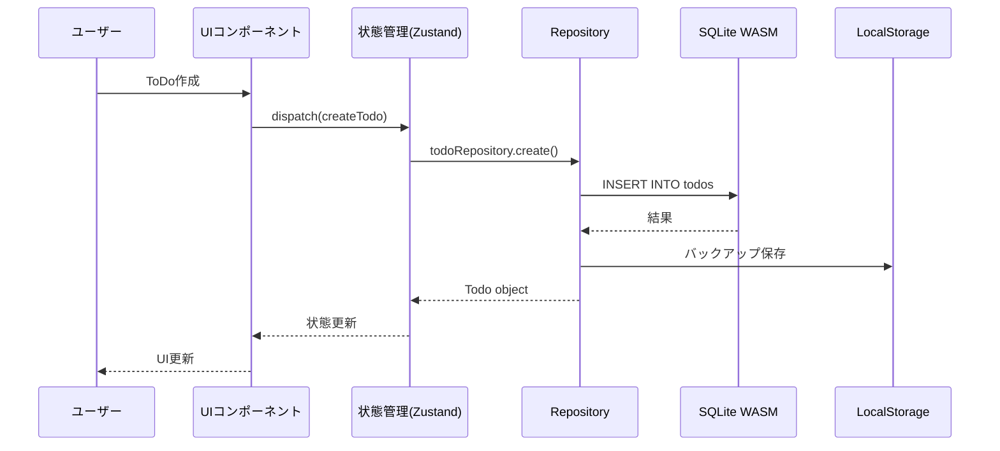
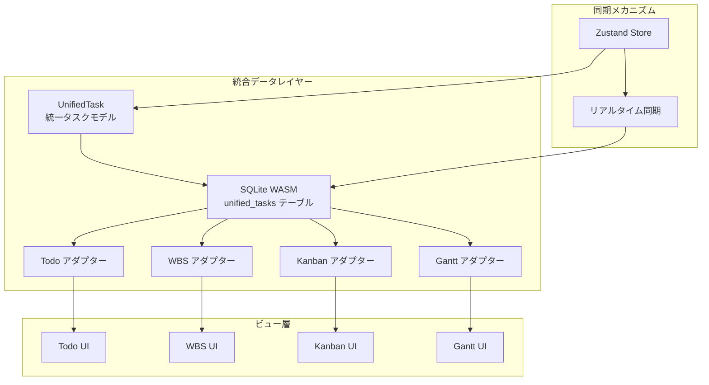
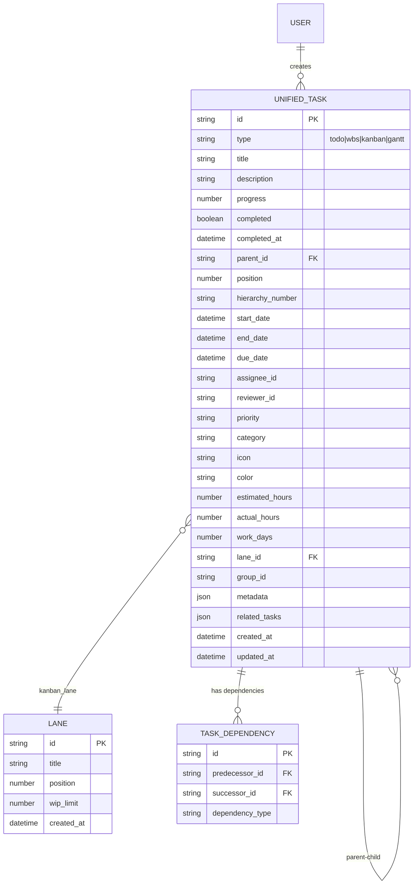

# 技術設計書

## 概要
本設計書は、非プログラマー向け生産性ツール集の技術アーキテクチャと実装方針を定義します。ローカルファーストアプローチを採用し、SQLite WASMを中心としたオフライン対応のWebアプリケーションを構築します。Next.js 14のApp Routerとサーバーコンポーネントを活用し、初期ロードの高速化とSEO最適化を実現しながら、すべてのデータ操作をクライアントサイドで完結させます。

## 要件マッピング

### 設計コンポーネントのトレーサビリティ
各設計コンポーネントが対応する要件：
- **SQLite WASMデータレイヤー** → 要件5.1-5.7: データ永続化とセキュリティ
- **Todoモジュール** → 要件1.1-1.7: ToDo管理機能
- **WBSモジュール** → 要件2.1-2.7: WBS機能
- **カンバンモジュール** → 要件3.1-3.7: カンバンボード機能
- **ガントチャートモジュール** → 要件4.1-4.7: ガントチャート機能
- **UIコンポーネントライブラリ** → 要件6.1-6.7: ユーザーインターフェース

### ユーザーストーリーカバレッジ
- 一般職の利用者向けToDo管理: 直感的なUIとオフライン対応により実現
- プロジェクトマネージャー向けWBS/ガント: 階層構造とタイムライン可視化で対応
- チームメンバー向けカンバン: ドラッグ&ドロップによる状態管理で実装
- 個人ユーザー向けデータ保護: ローカル完結型アーキテクチャで保証

## アーキテクチャ

### 全体アーキテクチャ



### 統合アーキテクチャ詳細



### 技術スタック

- **フロントエンド**: Next.js 14 (App Router) + TypeScript 5.x
- **状態管理**: Zustand (グローバル状態) + React Query (非同期状態)
- **データベース**: SQLite WASM 3.45+ (OPFS/IndexedDB)
- **UIフレームワーク**: Shadcn/ui + Radix UI + Tailwind CSS 3.4
- **ビルド/配信**: Cloudflare Workers + Wrangler
- **テスト**: Vitest + Testing Library + Playwright
- **開発環境**: Bun (高速ビルド) + ESLint + Prettier

### アーキテクチャ決定根拠

- **なぜSQLite WASM**: 完全オフライン対応、複雑なクエリ対応、トランザクション保証、5MB制限の回避
- **なぜNext.js 14**: 静的生成による高速初期表示、React Server Components、優れた開発体験
- **なぜZustand**: 軽量（8KB）、TypeScript親和性、React Suspense対応、シンプルなAPI
- **なぜShadcn/ui**: 高いアクセシビリティ、カスタマイズ性、コンポーネントの所有権、軽量

### 画面遷移



### データフロー

#### 主要ユーザーフロー



## コンポーネントとインターフェース

### バックエンドサービス＆メソッドシグネチャ

```typescript
// 統合Repository層
class UnifiedTaskRepository {
  // 基本CRUD操作
  async create(task: Partial<UnifiedTask>): Promise<UnifiedTask>
  async update(id: string, task: Partial<UnifiedTask>): Promise<UnifiedTask>
  async delete(id: string): Promise<void>
  async findById(id: string): Promise<UnifiedTask | null>
  async findByType(type: UnifiedTask['type']): Promise<UnifiedTask[]>
  async findAll(filter?: TaskFilter): Promise<UnifiedTask[]>
  
  // 階層構造操作
  async findChildren(parentId: string): Promise<UnifiedTask[]>
  async updateHierarchy(taskId: string, parentId: string | null): Promise<void>
  async updateHierarchyNumbers(parentId: string): Promise<void>
  async calculateProgress(taskId: string): Promise<number>
  
  // スケジュール操作
  async updateSchedule(taskId: string, dates: { start?: Date; end?: Date; due?: Date }): Promise<void>
  async calculateWorkDays(startDate: Date, endDate: Date): Promise<number>
  
  // カンバン操作
  async moveToLane(taskId: string, laneId: string, position: number): Promise<void>
  async checkWIPLimit(laneId: string): Promise<boolean>
  
  // 依存関係操作
  async createDependency(predecessorId: string, successorId: string): Promise<void>
  async removeDependency(predecessorId: string, successorId: string): Promise<void>
  async calculateCriticalPath(projectId: string): Promise<string[]>
  
  // 検索・フィルタ
  async search(query: string): Promise<UnifiedTask[]>
  async findByDateRange(startDate: Date, endDate: Date): Promise<UnifiedTask[]>
  async findByAssignee(assigneeId: string): Promise<UnifiedTask[]>
  
  // ビュー間連携
  async linkTasks(taskId: string, relatedTasks: Partial<UnifiedTask['relatedTasks']>): Promise<void>
  async unlinkTasks(taskId: string, viewType: keyof UnifiedTask['relatedTasks']): Promise<void>
  
  // 一括操作
  async bulkUpdate(taskIds: string[], updates: Partial<UnifiedTask>): Promise<void>
  async bulkDelete(taskIds: string[]): Promise<void>
}

// レーン管理Repository
class LaneRepository {
  async create(data: CreateLaneDto): Promise<Lane>
  async update(id: string, data: UpdateLaneDto): Promise<Lane>
  async delete(id: string): Promise<void>
  async findAll(): Promise<Lane[]>
  async reorder(laneId: string, newPosition: number): Promise<void>
}

// 依存関係管理Repository
class DependencyRepository {
  async create(data: CreateDependencyDto): Promise<TaskDependency>
  async delete(id: string): Promise<void>
  async findByTask(taskId: string): Promise<TaskDependency[]>
  async hasCyclicDependency(predecessorId: string, successorId: string): Promise<boolean>
}
```

### フロントエンドコンポーネント

| コンポーネント名 | 責任 | Props/State概要 |
|--------------|------|----------------|
| **統合コンポーネント** | | |
| IntegratedLayout | 統合レイアウト管理 | currentView, onViewChange |
| ViewSwitcher | ビュー切り替えタブ | views[], activeView, onSwitch |
| UnifiedTaskFilter | 統合フィルタパネル | filters, onFilterChange |
| GlobalSearch | グローバル検索 | onSearch, searchResults |
| TaskDetailDialog | 統合タスク詳細ダイアログ | task, onSave, onClose |
| TaskLinkManager | タスク連携管理 | task, linkedTasks, onLink, onUnlink |
| BulkActions | 一括操作ツールバー | selectedTasks[], onBulkAction |
| QuickActionMenu | クイックアクションメニュー | task, onAction |
| CrossViewDnD | ビュー間ドラッグ&ドロップ | onDrop, acceptTypes[] |
| NotificationCenter | 通知センター | notifications[], onDismiss |
| **Todo コンポーネント** | | |
| TodoList | ToDo一覧表示・フィルタリング | todos[], filter, onTodoClick |
| TodoForm | ToDo作成・編集フォーム | todo?, onSubmit, onCancel |
| **WBS コンポーネント** | | |
| WBSTree | WBS階層構造表示 | tasks[], onTaskDrop, onTaskClick |
| WBSTreeEnhanced | WBS拡張階層表示 | tasks[], onTaskClick, showTaskNumbers, colorByStatus, showColumnSettings |
| WBSTaskFormEnhanced | WBS拡張タスクフォーム | task?, parentTask?, onSubmit, onCancel, enableDateCalculation |
| WBSTaskFormPro | WBSプロフェッショナルフォーム | task?, parentTask?, onSubmit, onCancel, isInsertMode |
| WBSTablePro | WBSプロフェッショナルテーブル | tasks[], onTaskClick, onInsertTask, onUpdateTask, onDeleteTask |
| WBSTaskReorder | タスク順序変更機能 | task, onReorder, constraints |
| WBSTaskDelete | タスク削除機能 | task, onDelete, deleteChildren |
| WBSInsertTaskButton | タスク挿入ボタン | position, onInsert |
| WBSColumnResizer | 列幅調整機能 | columns[], onResize |
| **カンバンコンポーネント** | | |
| KanbanBoard | カンバンボード表示 | lanes[], cards[], onCardMove |
| **ガントコンポーネント** | | |
| GanttChart | ガントチャート表示 | tasks[], dependencies[], zoom, viewMode |
| GanttToolbar | ガントツールバー | viewMode, onViewChange, onMemberManage |
| GanttTaskIcon | タスクアイコン表示 | type, size |
| GanttColorPicker | 色選択 | colors[], onColorSelect |
| GanttMemberSelector | メンバー選択 | members[], onMemberSelect |
| GanttGroupManager | グループ管理 | groups[], onGroupCreate, onGroupEdit |
| GanttViewSelector | ビュー切り替え | currentView, onViewChange |
| GanttCalendarHeader | カレンダーヘッダー | year, month, days[], zoom |
| **共通コンポーネント** | | |
| DataManager | データインポート/エクスポート | onExport, onImport, onClear |
| ThemeToggle | テーマ切り替え | theme, onThemeChange |

### APIエンドポイント

本アプリケーションはローカルファーストのため、従来のREST APIは存在しません。代わりに、クライアントサイドのRepositoryインターフェースを提供：

| メソッド | インターフェース | 目的 | 認証 | エラーハンドリング |
|---------|---------------|------|------|------------------|
| create | Repository.create(data) | リソース作成 | 不要 | try-catch |
| read | Repository.findAll/findById | リソース取得 | 不要 | try-catch |
| update | Repository.update(id, data) | リソース更新 | 不要 | try-catch |
| delete | Repository.delete(id) | リソース削除 | 不要 | try-catch |

## データモデル

### 統合データアーキテクチャ



### ドメインエンティティ
1. **UnifiedTask**: 統合タスクモデル（全ビューで共通利用）
2. **Todo**: 基本的なタスク情報（UnifiedTaskのサブセット）
3. **WBSTask**: 階層的タスク（UnifiedTaskの拡張）
4. **KanbanCard**: カンバンカード（UnifiedTaskの表現形式）
5. **Lane**: カンバンレーン（カードのグルーピング）
6. **GanttTask**: ガントタスク（UnifiedTaskのスケジュール表現）
7. **User**: ユーザー設定（テーマ、言語、表示設定）

### エンティティ関係



### データモデル定義

```typescript
// 統合タスクモデル
interface UnifiedTask {
  // 基本属性
  id: string;
  type: 'todo' | 'wbs' | 'kanban' | 'gantt';
  title: string;
  description?: string;
  
  // 進捗管理
  progress: number; // 0-100
  completed: boolean;
  completedAt?: Date;
  
  // 階層構造
  parentId?: string;
  children?: string[];
  position: number;
  hierarchyNumber?: string;
  
  // スケジュール
  startDate?: Date;
  endDate?: Date;
  dueDate?: Date;
  
  // 担当者
  assigneeId?: string;
  reviewerId?: string;
  
  // 共通拡張
  priority?: 'high' | 'medium' | 'low';
  labels?: string[];
  category?: string;
  icon?: string;
  color?: string;
  
  // 工数
  estimatedHours?: number;
  actualHours?: number;
  workDays?: number;
  
  // カンバン固有
  laneId?: string;
  
  // ガント固有
  dependencies?: string[];
  isCriticalPath?: boolean;
  groupId?: string;
  
  // 関連タスク（ビュー間連携）
  relatedTasks?: {
    todoId?: string;
    wbsTaskId?: string;
    kanbanCardId?: string;
    ganttTaskId?: string;
  };
  
  // メタデータ
  metadata?: Record<string, any>;
  
  // タイムスタンプ
  createdAt: Date;
  updatedAt: Date;
}

// ビュー固有の型定義（UnifiedTaskからの変換）
interface Todo extends Pick<UnifiedTask, 
  'id' | 'title' | 'description' | 'dueDate' | 'priority' | 'completed' | 'completedAt' | 'createdAt' | 'updatedAt'> {
  // Todo固有の属性
}

interface WBSTask extends UnifiedTask {
  // WBS固有の拡張
  actualHours: number;
  estimatedHours: number;
  workDays: number;
  remarks?: string;
}

interface KanbanCard extends Pick<UnifiedTask,
  'id' | 'title' | 'description' | 'laneId' | 'position' | 'labels' | 'dueDate' | 'createdAt' | 'updatedAt'> {
  // カンバン固有の属性
  todoId?: string; // リンクされたToDo
}

interface GanttTask extends UnifiedTask {
  // ガント固有の拡張
  startDate: Date;
  endDate: Date;
  dependencies: string[];
  isCriticalPath: boolean;
  assigneeIcon?: string;
  wbsTaskId?: string; // リンクされたWBSタスク
}
```

### データベーススキーマ

```sql
-- 統合タスクテーブル
CREATE TABLE unified_tasks (
  id TEXT PRIMARY KEY,
  type TEXT NOT NULL CHECK(type IN ('todo', 'wbs', 'kanban', 'gantt')),
  title TEXT NOT NULL,
  description TEXT,
  progress INTEGER DEFAULT 0,
  completed INTEGER DEFAULT 0,
  completed_at INTEGER,
  parent_id TEXT,
  position INTEGER NOT NULL DEFAULT 0,
  hierarchy_number TEXT,
  start_date INTEGER,
  end_date INTEGER,
  due_date INTEGER,
  assignee_id TEXT,
  reviewer_id TEXT,
  priority TEXT CHECK(priority IN ('low', 'medium', 'high')),
  category TEXT,
  icon TEXT,
  color TEXT,
  estimated_hours REAL,
  actual_hours REAL,
  work_days REAL,
  lane_id TEXT,
  group_id TEXT,
  metadata TEXT, -- JSON
  related_tasks TEXT, -- JSON
  created_at INTEGER NOT NULL,
  updated_at INTEGER NOT NULL,
  FOREIGN KEY (parent_id) REFERENCES unified_tasks(id) ON DELETE CASCADE,
  FOREIGN KEY (lane_id) REFERENCES kanban_lanes(id) ON DELETE SET NULL
);

-- ラベル（多対多）
CREATE TABLE task_labels (
  task_id TEXT NOT NULL,
  label TEXT NOT NULL,
  color TEXT NOT NULL,
  PRIMARY KEY (task_id, label),
  FOREIGN KEY (task_id) REFERENCES unified_tasks(id) ON DELETE CASCADE
);

-- タスク依存関係
CREATE TABLE task_dependencies (
  id TEXT PRIMARY KEY,
  predecessor_id TEXT NOT NULL,
  successor_id TEXT NOT NULL,
  dependency_type TEXT DEFAULT 'finish_to_start',
  FOREIGN KEY (predecessor_id) REFERENCES unified_tasks(id) ON DELETE CASCADE,
  FOREIGN KEY (successor_id) REFERENCES unified_tasks(id) ON DELETE CASCADE
);

-- カンバンレーン（独立エンティティ）
CREATE TABLE kanban_lanes (
  id TEXT PRIMARY KEY,
  title TEXT NOT NULL,
  position INTEGER NOT NULL,
  wip_limit INTEGER,
  created_at INTEGER NOT NULL
);

-- インデックス
CREATE INDEX idx_tasks_type ON unified_tasks(type);
CREATE INDEX idx_tasks_parent ON unified_tasks(parent_id);
CREATE INDEX idx_tasks_due_date ON unified_tasks(due_date);
CREATE INDEX idx_tasks_completed ON unified_tasks(completed);
CREATE INDEX idx_tasks_lane ON unified_tasks(lane_id);
CREATE INDEX idx_tasks_assignee ON unified_tasks(assignee_id);
CREATE INDEX idx_tasks_dates ON unified_tasks(start_date, end_date);

-- ビュー（互換性レイヤー）
CREATE VIEW todos AS 
  SELECT id, title, description, due_date, priority, completed, completed_at, created_at, updated_at
  FROM unified_tasks 
  WHERE type = 'todo' OR (type != 'todo' AND due_date IS NOT NULL);

CREATE VIEW wbs_tasks AS
  SELECT * FROM unified_tasks WHERE type = 'wbs';

CREATE VIEW kanban_cards AS
  SELECT id, title, description, lane_id, position, due_date, created_at, updated_at,
         json_extract(related_tasks, '$.todoId') as todo_id
  FROM unified_tasks 
  WHERE lane_id IS NOT NULL;

CREATE VIEW gantt_tasks AS
  SELECT *, json_extract(related_tasks, '$.wbsTaskId') as wbs_task_id
  FROM unified_tasks 
  WHERE type = 'gantt' OR (start_date IS NOT NULL AND end_date IS NOT NULL);
```

### マイグレーション戦略
- 初回起動時に統合スキーマを作成
- 既存データを統合テーブルに移行するマイグレーションスクリプト
- バージョン管理テーブルでスキーマバージョンを追跡
- 新バージョンでは自動マイグレーションを実行
- データ変換は可逆的に設計し、ロールバック可能に
- 既存ビューを通じた後方互換性の維持

## エラーハンドリング

### エラー分類と対処
1. **データベースエラー**: 自動リトライ後、ローカルストレージへフォールバック
2. **容量超過エラー**: 古いデータの自動アーカイブ提案
3. **データ整合性エラー**: トランザクションロールバック、ユーザーへ通知
4. **ブラウザ互換性エラー**: 機能制限モードへ自動切り替え

### ユーザー向けエラーメッセージ
- 技術的詳細を排除した平易な言葉
- 具体的な解決方法の提示
- エラーコードによるサポート対応

## セキュリティ考慮事項

### データ保護
- Web Crypto APIによるクライアントサイド暗号化（オプション）
- パスワード保護されたエクスポート機能
- XSS対策: React自動エスケープ + Content Security Policy

### プライバシー保護
- 完全ローカル動作、外部通信なし
- アナリティクスはオプトイン方式
- データは明示的な操作以外で共有されない

## パフォーマンス＆スケーラビリティ

### パフォーマンス目標
| メトリクス | 目標値 | 測定対象 |
|-----------|--------|----------|
| 初期表示時間 (FCP) | < 1.5秒 | 初回訪問時 |
| インタラクティブ時間 (TTI) | < 3秒 | 初回訪問時 |
| データ操作レスポンス | < 100ms | CRUD操作 |
| SQLiteクエリ (p99) | < 50ms | 複雑なクエリ |
| メモリ使用量 | < 150MB | 1000件データ |

### キャッシング戦略
- **ブラウザキャッシュ**: 静的アセット、Service Worker
- **メモリキャッシュ**: Zustand内の頻繁アクセスデータ
- **SQLiteキャッシュ**: プリペアドステートメント
- **計算結果キャッシュ**: React.memo、useMemo活用

### スケーラビリティアプローチ
- 仮想スクロールによる大量データ表示
- Web Workersでの重い計算処理
- インクリメンタルな進捗計算
- 遅延ローディングとコード分割

## テスト戦略

### リスクマトリクス
| 領域 | リスク | 必須 | オプション | 参照 |
|-----|--------|------|-----------|------|
| データ永続性 | H | Unit, Integration | E2E | 5.1-5.7 |
| UI操作 | M | Unit, E2E | Visual | 6.1-6.7 |
| データ整合性 | H | Unit, Property | Integration | 全般 |
| パフォーマンス | M | Unit | Load | 性能表 |
| ブラウザ互換 | M | Unit | Cross-browser | 6.4 |

### 最小限のテスト層
- Unit: Repository層、ビジネスロジック、Utilityのテスト
- Integration: SQLite WASMとの統合テスト
- E2E (≤3): ToDo作成、カンバン操作、データエクスポート/インポート

### CIゲート
| ステージ | 実行内容 | ゲート | SLA |
|---------|---------|--------|-----|
| PR | Unit + Lint | 失敗=ブロック | ≤3分 |
| main | Integration + E2E | 失敗=ブロック | ≤10分 |
| リリース前 | 全テスト + ビルド | 失敗=停止 | ≤15分 |

### 終了条件
- 重大バグ = 0
- 全CIゲート通過
- Lighthouseスコア: Performance > 90